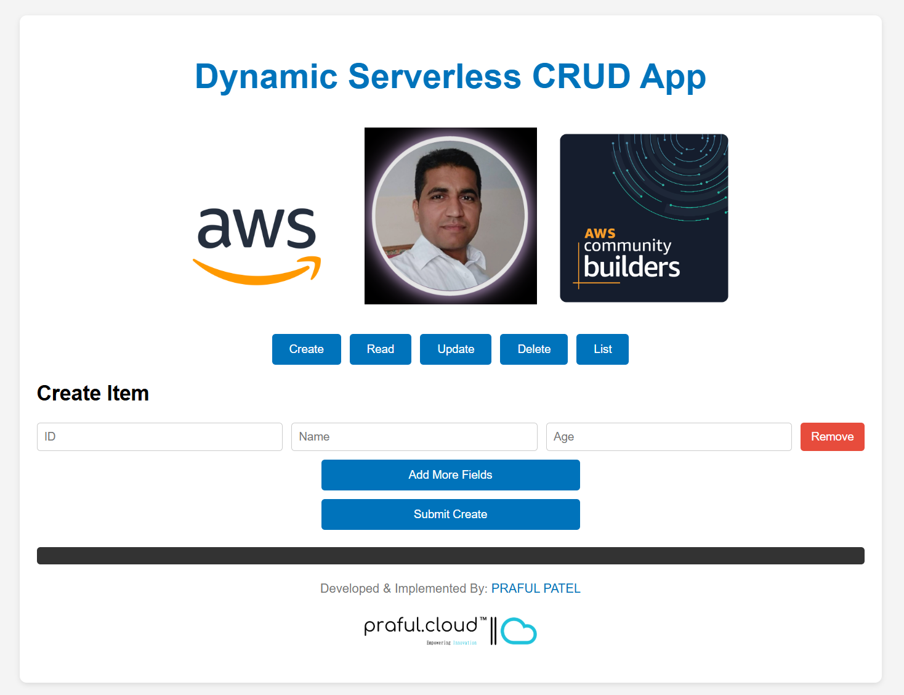

# 🚀 Serverless CRUD App

## 📌 About the Project

The **Serverless CRUD App** is a backend and frontend application that provides a fully serverless architecture for managing CRUD (Create, Read, Update, Delete) operations. It is built using AWS Serverless Application Model (AWS SAM), CloudFormation, and a structured backend API that integrates seamlessly with frontend services.

## Architectural Diagram


## Architectural Flow Diagram


## Application Frontend UI



# 🏗️ Serverless CRUD Application

Welcome to the **Serverless CRUD Application** repository! This project demonstrates how to build and deploy a fully serverless, scalable, and cost-effective CRUD (Create, Read, Update, Delete) system using **AWS** services such as **Lambda**, **API Gateway**, and **DynamoDB**. It also includes a simple **HTML/JavaScript** frontend hosted on **Amazon S3**.

## Table of Contents 📖

1. [About the Project](#about-the-project)  
2. [Architecture](#architecture)  
3. [Project Structure](#project-structure)  
4. [Prerequisites & Setup](#prerequisites--setup)  
5. [Documentations](#documentations)  
6. [Detailed Workflow](#detailed-workflow)  
7. [CRUD Operations](#crud-operations)  
8. [Deployment](#deployment)  
9. [Local Testing](#local-testing)  
10. [Contributing](#contributing)  
11. [License](#license)  
12. [Author](#author)

---

## About the Project 📝

The **Serverless CRUD App** provides a fully serverless architecture for managing CRUD operations. It leverages AWS SAM and CloudFormation for infrastructure as code, and AWS Lambda + API Gateway for backend logic. A simple HTML/JS frontend (hosted on S3) communicates with these services to perform operations on a DynamoDB table.

**Why build a Serverless CRUD app?**
- **Scalability:** Serverless architectures automatically scale based on demand.  
- **Pay-as-you-go:** Pay only for the compute time and resources used.  
- **Simplicity:** Focus on business logic rather than server maintenance.  
- **Reliability:** AWS services provide high availability out of the box.

**When is this useful?**
- **Rapid Prototyping:** Quickly build a backend without provisioning servers.  
- **Low to Medium Traffic Apps:** Perfect for moderate workloads and spiky usage.  
- **Cost Optimization:** Ideal for apps with intermittent usage.

---

## Architecture 🏗️

``` 
```
## 🏗️ Architectural Diagram


1. **Frontend (S3):** Hosts the static HTML, CSS, and JS.
2. **API Gateway:** Manages RESTful endpoints for CRUD operations.
3. **Lambda Functions:** Implements each CRUD operation (Create, Read, Update, Delete).
4. **DynamoDB:** Stores items with fields like `id`, `name`, `age`.

**Key AWS Services:**
- **AWS Lambda:** Serverless compute environment for the CRUD logic.
- **Amazon DynamoDB:** NoSQL database for storing items.
- **Amazon API Gateway:** Routes incoming HTTP requests to the appropriate Lambda function.
- **Amazon S3:** Hosts the static frontend.


# Architectural Perspective & Event-Driven Classification

This document provides an architectural overview of the **Serverless CRUD App** and discusses its classification in terms of synchronous versus asynchronous Event-Driven Architecture (EDA).

---

## Overview of the Architecture 🏗️

The **Serverless CRUD App** leverages a modern AWS serverless stack:

- **Frontend (S3 + CloudFront):**  
  A static HTML/JavaScript application hosted on Amazon S3 (optionally served via CloudFront for improved global performance).

- **API Gateway:**  
  Acts as the HTTP interface that exposes RESTful endpoints (POST, GET, PUT, DELETE, etc.) to the frontend.

- **AWS Lambda Functions:**  
  Implements each CRUD operation. These functions are triggered synchronously by API Gateway requests.

- **Amazon DynamoDB:**  
  A NoSQL database where the application stores its data, keyed by unique IDs.

This design enables rapid scaling, cost efficiency, and a low operational footprint.

---

## Synchronous vs. Asynchronous Event-Driven Architecture ⚙️

### Synchronous Architecture

- **Definition:**  
  In a synchronous system, components interact in real-time. The caller (e.g., API Gateway) waits for the invoked service (e.g., a Lambda function) to complete and return a response before proceeding.
  
- **Characteristics:**
  - **Real-time Response:** The client receives an immediate response.
  - **Direct Invocation:** The request-response flow is tightly coupled.
  - **Blocking Calls:** The calling service is blocked until the response arrives.

### Asynchronous Architecture

- **Definition:**  
  In an asynchronous system, events are processed independently. The caller sends a message (or event) and does not wait for an immediate response. Instead, the processing happens in the background, often via queues, event buses, or stream processing.
  
- **Characteristics:**
  - **Decoupled Components:** Producers and consumers operate independently.
  - **Eventual Consistency:** The response or effect of the event may be delayed.
  - **Scalability:** Often ideal for high-throughput, non-blocking operations.

---

## Classification of the Serverless CRUD App 🔎

**The Serverless CRUD App is classified as a Synchronous System within an Event-Driven Architecture.**

### Why Synchronous?

- **Direct API Invocation:**  
  API Gateway invokes Lambda functions synchronously. Each CRUD operation (Create, Read, Update, Delete) waits for the Lambda function to execute and return a response before the API Gateway sends that response back to the client.

- **Immediate Response Required:**  
  Operations such as reading a record or updating a record require an immediate response so the frontend can display the results directly to the user.

- **No Message Queues:**  
  The architecture does not use queues (e.g., SQS) or event buses (e.g., EventBridge) to decouple the process. The interaction is a direct request-response cycle.

### Event-Driven Elements

Even though the system is synchronous, it still follows an **event-driven** paradigm in that:
- **Events Trigger Functions:**  
  Each API call (HTTP request) is treated as an event that triggers a corresponding Lambda function.
- **Loose Coupling:**  
  While the API Gateway and Lambda are directly connected, the Lambda functions themselves are independent and can be updated or scaled separately.
- **Resilience:**  
  Using Lambda and DynamoDB provides built-in scaling and fault tolerance typical of event-driven architectures.

---

## Architectural Benefits 🌟

- **Scalability & Cost Efficiency:**  
  AWS Lambda and DynamoDB scale automatically and you pay only for what you use.
- **Rapid Development:**  
  The serverless model accelerates development by removing server management tasks.
- **High Availability:**  
  AWS services ensure high availability and reliability.

---

## Conclusion 🎉

The **Serverless CRUD App** is a **synchronous event-driven application** where API Gateway synchronously invokes Lambda functions to process CRUD operations. While it leverages event-driven principles (triggering functions based on HTTP events), the request-response cycle is handled synchronously to meet the immediate needs of user interaction.

This architecture is ideal for applications requiring real-time feedback and a tightly coupled, yet scalable, interaction model.

---

## 📁 Project Structure

```
serverless-crud-app/
│-- .aws-sam/               # ⚡ AWS SAM build artifacts
│-- backend/
│   ├── src/                # 🏗️ Source code for backend functions
│   │   ├── create/         # ✨ Lambda function for creating resources
│   │   ├── delete/         # ❌ Lambda function for deleting resources
│   │   ├── list/           # 📋 Lambda function for listing resources
│   │   ├── read/           # 📖 Lambda function for reading a single resource
│   │   ├── update/         # 🔄 Lambda function for updating resources
│   │   ├── documentations/ # 📜 API documentation (Swagger or Postman collection)
│-- frontend/
│   ├── index.html          # 🌐 Frontend application (basic UI)
│-- pipelines/              # 🔄 CI/CD pipeline configurations
│-- .gitignore              # 🚫 Git ignore file
│-- cloudformation.yaml     # ☁️ CloudFormation stack configuration
│-- README.md               # 📘 Project documentation
│-- response.json           # 📝 Sample API responses
│-- samconfig.toml          # ⚙️ AWS SAM configuration file
│-- template.yaml           # 🏗️ AWS SAM template definition

```
Below is an example directory layout you might see in this repository:

```bash
aws-serverless-CRUD-application/
├── backend/
│   ├── create/
│   │   └── app.py
│   ├── read/
│   │   └── app.py
│   ├── update/
│   │   └── app.py
│   ├── delete/
│   │   └── app.py
│   └── list/
│       └── app.py
├── frontend/
│   └── index.html
├── pipelines/
│   └── pipeline-config.yml
├── cloudformation.yaml
└── README.md
```

1. **backend/**  
   Contains the Lambda function code for each CRUD operation.
2. **frontend/**  
   Hosts the static HTML, CSS, and JS for the UI.
3. **pipelines/**  
   Houses CI/CD pipeline configurations (e.g., GitHub Actions or AWS CodePipeline).
4. **cloudformation.yaml**  
   Defines AWS resources (e.g., DynamoDB table, Lambda functions, API Gateway) via Infrastructure as Code.
5. **README.md**  
   Provides an overview and documentation for the project.

---

## Prerequisites & Setup 🛠️

1. **AWS Account:**  
   You’ll need an AWS account to deploy Lambda, DynamoDB, and API Gateway resources.
2. **AWS CLI:**  
   [Install](https://docs.aws.amazon.com/cli/latest/userguide/getting-started-install.html) and configure the AWS CLI with your credentials.
3. **SAM or CloudFormation:**  
   [AWS SAM](https://docs.aws.amazon.com/serverless-application-model/latest/developerguide/what-is-sam.html) or CloudFormation for packaging and deploying.
4. **Node.js / Python (optional):**  
   If you want to run or test code locally, ensure the relevant runtime is installed.

---
---

## Documentations 📜

This repository may contain additional documentation files in a `documentations` or `docs` folder:

- **0.0.pre-requisite.md**  
  Explains pre-requisites for the project.
- **0.1.IAM-roles.md**  
  Details about IAM roles and minimal privileges needed.
- **1.API-document.md**  
  Full API specification (endpoints, payloads, response formats).
- **2.Api-testing.md**  
  Guidelines on using Postman or cURL to test the API.
- **3.app-functionality.md**  
  A deeper look into the frontend and how it interacts with the backend.
- **4.frontend-doc.md**  
  Step-by-step instructions for hosting the frontend on S3.
- **5.sam-infra-documentation.md**  
  Explains the SAM/CloudFormation infrastructure in detail.

---


## Detailed Workflow 🔄

1. **User Accesses the Frontend (S3):**  
   The user opens the static site in their browser.

2. **User Chooses CRUD Operation:**  
   - Create: Fills out ID, Name, Age fields.  
   - Read: Enters an ID.  
   - Update: Enters an ID and new fields (Name, Age).  
   - Delete: Enters an ID to remove.  
   - List: Retrieves all items from the DynamoDB table.

3. **Frontend Sends a Request via API Gateway:**  
   The request is routed to the correct Lambda function (Create, Read, Update, Delete, or List).

4. **Lambda Function Processes the Request:**  
   - Reads/writes data in **DynamoDB**.  
   - Returns a JSON response with status code, headers, and body.

5. **Response Returned to Frontend:**  
   - Displays success or error in the output area.

---

## CRUD Operations ⚙️

1. **Create (POST /create)**  
   - **Frontend**: Sends an array of items (e.g., `[{ id, name, age }, ...]`).  
   - **Lambda**: Inserts each item into DynamoDB with `put_item`.

2. **Read (GET /read?id=123)**  
   - **Frontend**: Appends `?id=123` to the URL.  
   - **Lambda**: Retrieves the item from DynamoDB with `get_item(Key={"id": ...})`.

3. **Update (PUT /update)**  
   - **Frontend**: Sends a JSON payload containing the `id` and new fields.  
   - **Lambda**: Uses `update_item` with dynamic update expressions.

4. **Delete (DELETE /delete)**  
   - **Frontend**: Sends a JSON payload with `"Key": { "id": "..." }`.  
   - **Lambda**: Calls `delete_item(Key={ "id": ... })`.

5. **List (GET /list)**  
   - **Frontend**: Issues a GET request to retrieve all items.  
   - **Lambda**: Scans the DynamoDB table or queries it to list items.

---

## Deployment & Configuration 🚀

1. **CloudFormation / AWS SAM:**  
   - `sam build && sam deploy` to create/update resources.  
   - The template includes definitions for the Lambda functions, DynamoDB table, and API Gateway endpoints.

2. **S3 Frontend Hosting:**  
   - Upload the `frontend/index.html` (and any assets) to your S3 bucket.  
   - Enable **Static website hosting** on the bucket.

3. **Environment Variables:**  
   - `TABLE_NAME`: The DynamoDB table name.  
   - Ensure your Lambda function references this variable in the code.

4. **CORS Settings:**  
   - Each Lambda response includes headers for `Access-Control-Allow-Origin: *`.  
   - API Gateway is configured with **Lambda Proxy Integration** to pass these headers through.


## ✨ Features
- **🛠️ Serverless Backend**: Uses AWS Lambda for CRUD operations.
- **📜 Infrastructure as Code**: AWS CloudFormation and AWS SAM templates.
- **🎨 Frontend UI**: Basic HTML page to interact with the API.
- **📖 API Documentation**: Includes Swagger/Postman collection.
- **🚀 CI/CD Pipelines**: Automates deployments using AWS CodePipeline or GitHub Actions.

## 🛠️ Prerequisites
Before you start, ensure you have the following installed:
- **AWS CLI** - [Installation Guide](https://docs.aws.amazon.com/cli/latest/userguide/install-cliv2.html)
- **AWS SAM CLI** - [Installation Guide](https://docs.aws.amazon.com/serverless-application-model/latest/developerguide/install-sam-cli.html)
- **Docker** - Required for building dependencies
- **Node.js & npm** - For frontend development

## 📦 Installation & Setup

### 1️⃣ Clone the Repository
```sh
 git clone https://github.com/your-repo/serverless-crud-app.git
 cd serverless-crud-app
```

### 2️⃣ Install Backend Dependencies
```sh
cd backend/src
sam build
```

### 3️⃣ Deploy the Serverless Application
```sh
sam deploy --guided
```
This command will prompt you for AWS configurations such as stack name, region, and permissions.

### 4️⃣ Running the Frontend
To serve the frontend locally, navigate to the `frontend` folder:
```sh
cd frontend
python -m http.server 8000
```
Then, open `http://localhost:8000/index.html` in your browser.

## 🔗 API Endpoints
The following API endpoints are provided by the serverless backend:

| Method | Endpoint       | Description             |
|--------|---------------|-------------------------|
| 🆕 POST   | `/create`      | Create a new resource  |
| 📋 GET    | `/list`        | List all resources     |
| 📖 GET    | `/read/{id}`   | Retrieve a single item |
| 🔄 PUT    | `/update/{id}` | Update an existing item|
| ❌ DELETE | `/delete/{id}` | Delete a resource      

## 🚀 Deployment Guidelines
1. **🛠️ Update the SAM template (`template.yaml`)** with appropriate AWS configurations.
2. **⚡ Run `sam build`** to prepare the application.
3. **🚀 Deploy with `sam deploy --guided`** for first-time setup.
4. **📊 Use AWS CloudFormation to monitor the stack deployment.**

## 🔄 CI/CD Pipeline Setup
This project includes pipeline configurations under the `pipelines/` directory. You can configure AWS CodePipeline or GitHub Actions for automated deployment.

## 🔒 Security Considerations
- 🛡️ Ensure IAM roles for Lambda have minimal privileges.
- ⚡ Use AWS API Gateway throttling to protect against excessive requests.
- 🔥 Enable AWS WAF to mitigate security threats.

---

## Local Testing 🧪

1. **Test with Postman:**  
   - **Create**: `POST /create` with a JSON body like `{"items": [{"id":"123","name":"Test","age":25}]}`.  
   - **Read**: `GET /read?id=123`.  
   - **Update**: `PUT /update` with `{"id":"123","name":"NewName","age":30}`.  
   - **Delete**: `DELETE /delete` with `{"Key":{"id":"123"}}`.  
   - **List**: `GET /list`.

2. **CloudWatch Logs:**  
   - Check logs for any errors if your requests fail.

---

## Contributing 🤝

1. **Fork & Clone:**  
   Fork the repository on GitHub and clone it locally.
2. **Create a Feature Branch:**  
   Use `git checkout -b feature/my-awesome-feature`.
3. **Commit & Push:**  
   Make changes, commit, and push to your fork.
4. **Open a Pull Request:**  
   Compare your feature branch against `main` and open a PR. Provide details about your changes.

---

## 🤝 Contributing

Contributions are welcome! Please check the [CONTRIBUTING.md](CONTRIBUTING.md) file for guidelines on how to contribute to this project.

---

## 📄 License

This project is licensed under the [MIT License](LICENSE).

---

## 🧑‍💻 Author

Created and maintained by **Praful Patel**.  
For inquiries, visit [Praful's GitHub](https://github.com/prafulpatel16).
For Tech, visit [Praful's Blog](https://www.praful.cloud).

---

**Happy Building!** If you have any questions or need further details, please refer to the AWS documentation:
- [AWS Lambda Documentation](https://docs.aws.amazon.com/lambda/)
- [Amazon API Gateway Documentation](https://docs.aws.amazon.com/apigateway/)
- [Amazon DynamoDB Documentation](https://docs.aws.amazon.com/dynamodb/)


