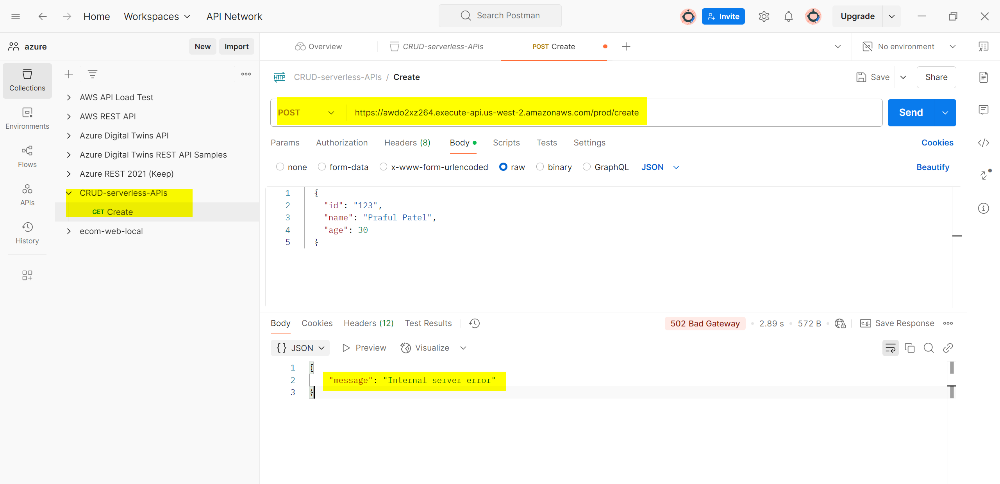
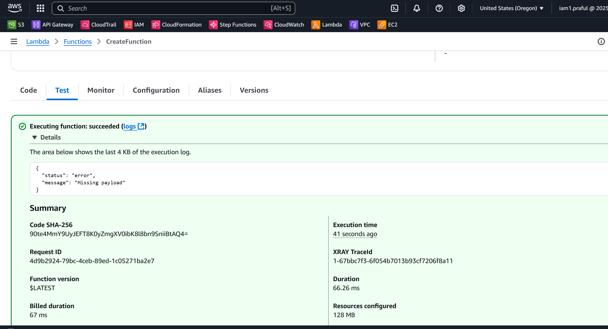
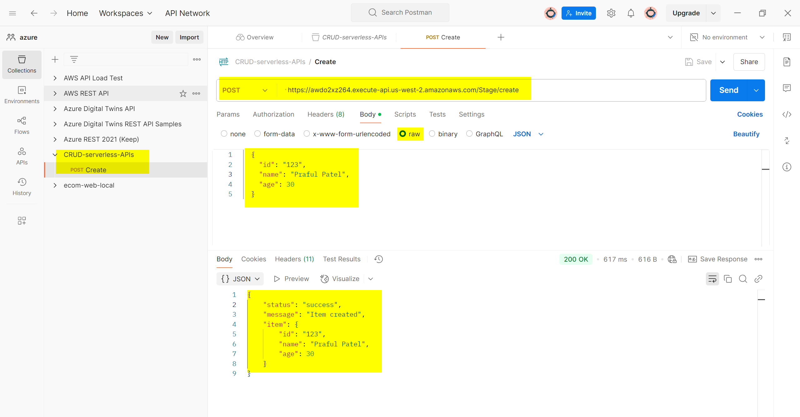
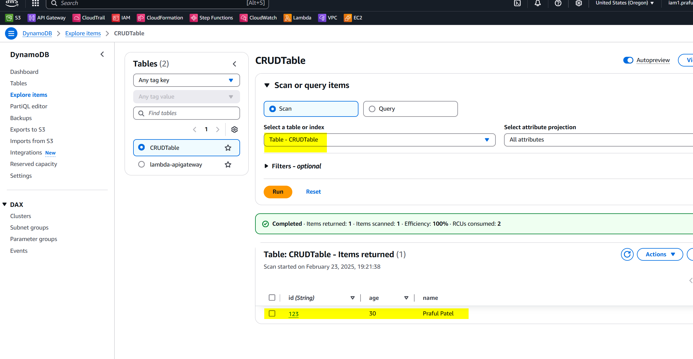
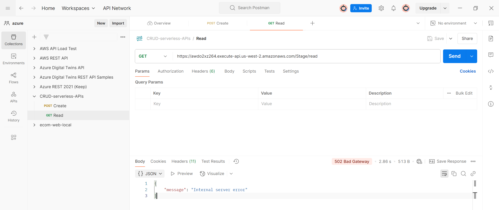

## API Testing

### CreatFunction- POST Method

- Creation error



# Error 



- Solution: needed to change the python code 

- Re run the test in postman - successful


- Verify into database that data inserted successfully



### **🚀 Fixing "Missing payload" in AWS Lambda Function**
Your AWS Lambda function is returning:
```json
{
  "status": "error",
  "message": "Missing payload"
}
```
This means that **the Lambda function is not receiving the expected payload format** from API Gateway.

---

## **✅ Step 1: Check API Gateway Invocation Format**
When AWS API Gateway triggers a Lambda function, the event structure is different from direct invocation. Your Lambda should extract the body **correctly**.

**🔍 Fix:**  
Modify your Lambda function to **parse the payload correctly**:

### **✔ Fixed Python Code**
```python
import boto3
import os
import json

def lambda_handler(event, context):
    table_name = os.environ.get("TABLE_NAME")
    dynamo = boto3.resource("dynamodb").Table(table_name)

    # 🛑 API Gateway sends body as a STRING, so we need to parse it
    try:
        body = json.loads(event["body"])  # ✅ Convert API Gateway body string to JSON
    except (KeyError, TypeError, json.JSONDecodeError):
        return {
            "statusCode": 400,
            "body": json.dumps({"status": "error", "message": "Invalid request format"})
        }

    # 🔍 Ensure required fields are present
    item = body.get("payload")
    if not item:
        return {
            "statusCode": 400,
            "body": json.dumps({"status": "error", "message": "Missing payload"})
        }

    # ✅ Insert item into DynamoDB
    try:
        dynamo.put_item(Item=item)
        return {
            "statusCode": 200,
            "body": json.dumps({"status": "success", "message": "Item created", "item": item})
        }
    except Exception as e:
        return {
            "statusCode": 500,
            "body": json.dumps({"status": "error", "message": str(e)})
        }
```
---
## **✅ Step 2: Ensure Correct API Gateway Request Format**
When calling your API Gateway endpoint, send the request **in the correct format**:
```json
{
  "payload": {
    "id": "123",
    "name": "Praful Patel",
    "age": 30
  }
}
```
Use **curl** or Postman to test:
```bash
curl -X POST "https://awdo2xz264.execute-api.us-west-2.amazonaws.com/prod/create" \
     -H "Content-Type: application/json" \
     -d '{"payload": {"id": "123", "name": "Praful Patel", "age": 30}}'
```
---

## **✅ Step 3: Test Lambda Function Directly**
Before testing via API Gateway, **invoke Lambda manually** to ensure it's working:
```bash
aws lambda invoke --function-name CreateFunction \
  --payload '{"body": "{\"payload\": {\"id\": \"123\", \"name\": \"Praful Patel\", \"age\": 30}}"}' response.json

cat response.json
```
If it works, the issue is **API Gateway event format**, not Lambda.

---

## **✅ Step 4: Enable API Gateway Logs**
If the issue persists:
1. **Go to AWS Console → API Gateway**
2. Navigate to **Stages → prod → Logs/Tracing**
3. **Enable CloudWatch Logs**
4. Deploy API Gateway again:
   ```bash
   aws apigateway create-deployment --rest-api-id YOUR_API_ID --stage-name prod
   ```
5. **Check logs** in CloudWatch:
   ```bash
   aws logs describe-log-groups --log-group-name-prefix /aws/apigateway
   ```

---

### **🎯 Summary**
| **Step** | **Fix** |
|----------|--------|
| **Fix Lambda function JSON parsing** | ✅ `json.loads(event["body"])` |
| **Ensure correct API Gateway request format** | ✅ `{"payload": {"id": "123", "name": "Praful"}}` |
| **Test Lambda manually** | ✅ `aws lambda invoke --function-name CreateFunction --payload '{}' response.json` |
| **Enable API Gateway logs** | ✅ AWS Console → API Gateway → Enable Logs |


###  ReadFunction- GET Method

### **Testing AWS API Gateway Endpoint in Postman (`/read` API)**
#### **API Endpoint:**
```plaintext
https://awdo2xz264.execute-api.us-west-2.amazonaws.com/stag/read
```

---

## **🛠 Steps to Test in Postman**

### **1️⃣ Open Postman**
- Ensure you have **Postman installed** (Download: [https://www.postman.com/downloads/](https://www.postman.com/downloads/)).

### **2️⃣ Set Request Type**
- Select **GET** method from the dropdown.

### **3️⃣ Enter the API Endpoint**
- In the **request URL** field, enter:
  ```
  https://awdo2xz264.execute-api.us-west-2.amazonaws.com/stag/read
  ```

### **4️⃣ Set Headers**
- Click on the **Headers** tab.
- Add the following key-value pair:
  ```
  Key: Content-Type
  Value: application/json
  ```

### **5️⃣ Click "Send"**
- Hit the **Send** button to make the API request.

---

## **✅ Expected Response**
If the Lambda function and DynamoDB integration are correct, the response should look like:
```json
{
  "status": "success",
  "data": [
    {
      "id": "123",
      "name": "Praful Patel",
      "age": 30
    },
    {
      "id": "124",
      "name": "John Doe",
      "age": 28
    }
  ]
}
```

---

## **❌ If You Get an Error**
### **1️⃣ "Internal Server Error" (500)**
- Check AWS CloudWatch logs for Lambda:
  ```bash
  aws logs tail /aws/lambda/ReadFunction --follow
  ```
- Ensure the Lambda function has **DynamoDB read permissions**.

### **2️⃣ "Missing Permissions" (403)**
- Verify that the API Gateway has permission to invoke Lambda.

### **3️⃣ "Invalid JSON Response"**
- Ensure that the Lambda function correctly formats its response.

---

## **📌 Additional Debugging Commands**
- **Test API via `curl`**:
  ```bash
  curl -X GET "https://awdo2xz264.execute-api.us-west-2.amazonaws.com/prod/read" \
       -H "Content-Type: application/json"
  ```
- **Check API Gateway Logs**:
  ```bash
  aws apigateway get-method --rest-api-id YOUR_API_ID --resource-id YOUR_RESOURCE_ID --http-method GET
  ```

---

## Error




