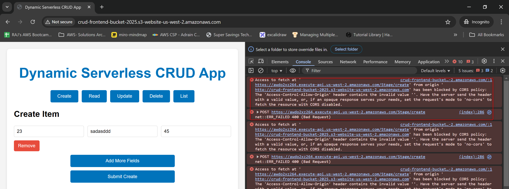
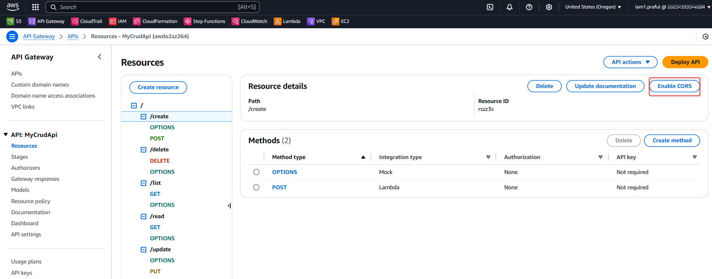
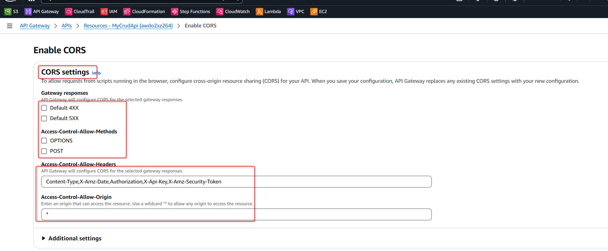
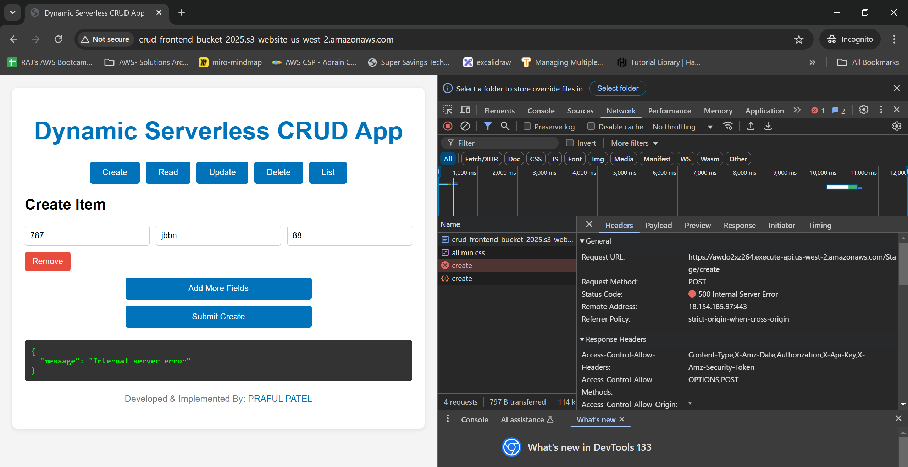
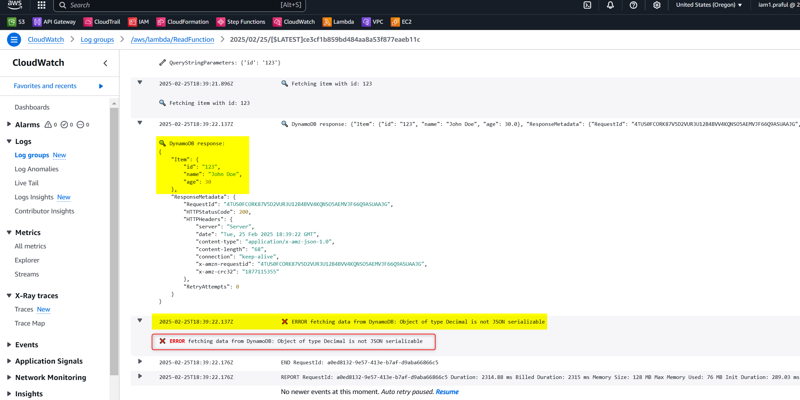
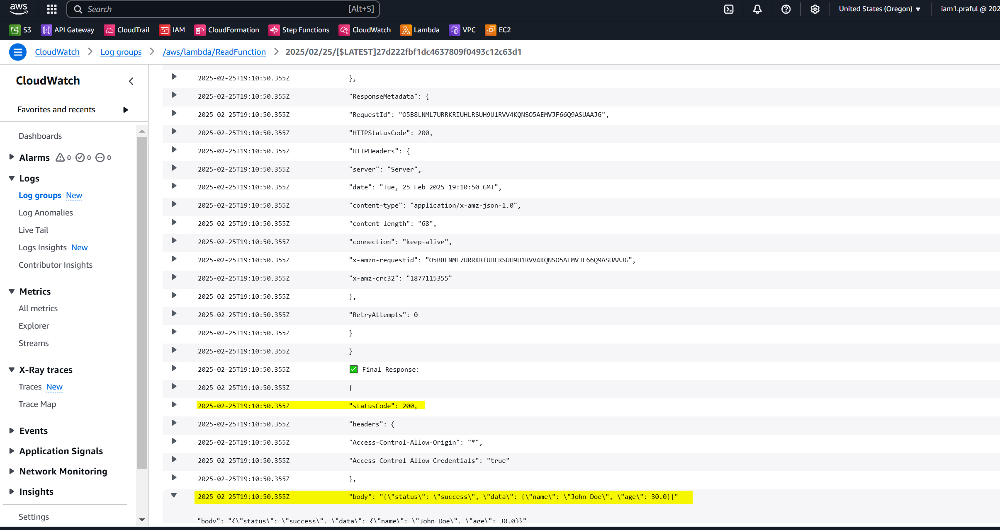
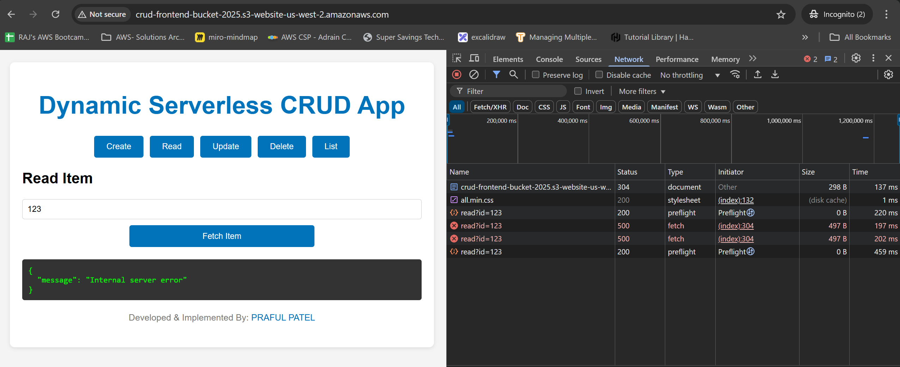
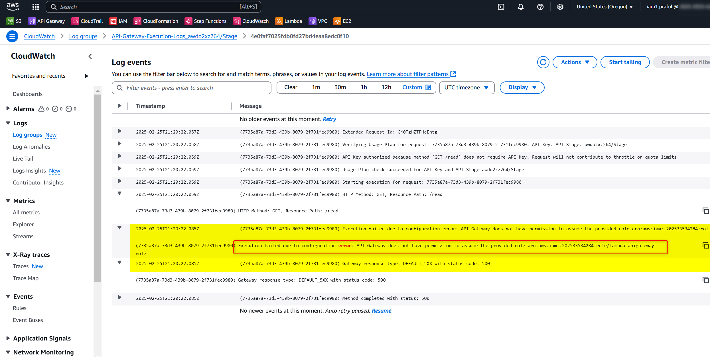
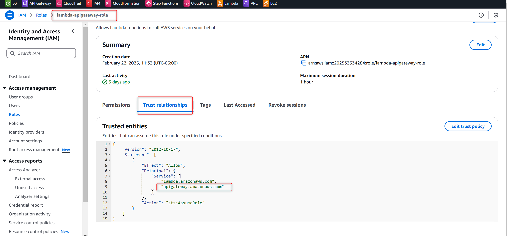
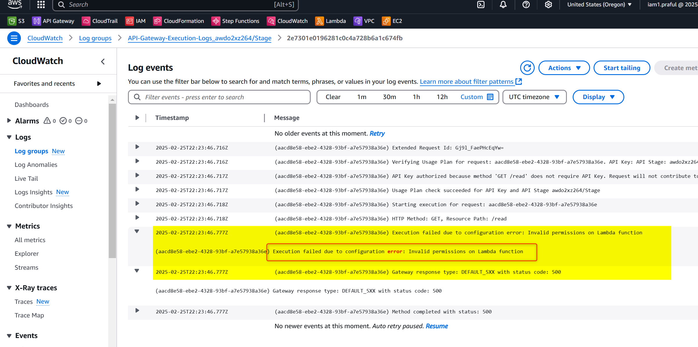

## Error 1



```md
## 🚀 Resolving CORS Error on API Request

### ⚠️ Error Message:
```pgsql
Access to fetch at 'https://awdo2xz264.execute-api.us-west-2.amazonaws.com/Stage/create' from origin 'http://crud-frontend-bucket-2025.s3-website-us-west-2.amazonaws.com' has been blocked by CORS policy: No 'Access-Control-Allow-Origin' header is present on the requested resource.
```

---

### 🔍 What It Means:
- **CORS** (Cross-Origin Resource Sharing) is a security mechanism implemented by browsers that restricts web pages from making requests to a different domain than the one that served the page.
- Your static site (hosted on **S3**) is on one origin (`http://crud-frontend-bucket-2025.s3-website-us-west-2.amazonaws.com`), while your API is on another (`https://awdo2xz264.execute-api.us-west-2.amazonaws.com/Stage`).
- The API response is missing the **Access-Control-Allow-Origin** header, causing the browser to block the response.

---

### 🔧 How to Fix:


#### 1️⃣ Enable CORS in API Gateway:





- Via **SAM/CloudFormation**:
```yaml
CrudApi:
  Type: AWS::Serverless::Api
  Properties:
    Name: "MyCrudApi"
    StageName: !Ref StageName
    Cors:
      AllowMethods: "'GET,POST,PUT,DELETE,OPTIONS'"
      AllowHeaders: "'Content-Type,Authorization,X-Amz-Date,X-Api-Key,X-Amz-Security-Token'"
      AllowOrigin: "'*'"
```
💡 **Tip:** If you wish to restrict origins, replace `'*'` with your S3 website URL.

---

#### 2️⃣ Check API Gateway Integration Settings:
- Ensure that your **API Gateway method integrations** pass through the proper headers.
- If you’re using a **Lambda proxy integration**, ensure that your Lambda function returns the **CORS headers**, or configure API Gateway to add them automatically.

---

#### 3️⃣ Test the Endpoint:
1. After updating your configuration, **redeploy your API**.
2. Use **Postman** or your browser’s **developer tools** to verify that the response includes an **Access-Control-Allow-Origin** header.

---

### ✅ Conclusion:
- Properly configuring CORS ensures that your frontend can communicate with your backend API securely.
- Always follow **least privilege** principles when allowing origins and headers. 🎯

# Error 2


## Upon diagnosing and checking the logs if found the below error from dtabase
2025-02-25T18:39:22.137Z
❌ ERROR fetching data from DynamoDB: Object of type Decimal is not JSON serializable




# Solution:
- Upon changing in Lambda code it resolved an error




# Error 
Still error appeared on the frontend side, since it's a 
Status Code:
500 Internal Server Error , something must be wrong with the server side, and API gateway needs to be logged




- Check API Gateway Logs


2025-02-25T21:20:22.085Z
(7735a87a-73d3-439b-8079-2f731fec9980) Execution failed due to configuration error: API Gateway does not have permission to assume the provided role arn:aws:iam::202533534284:role/lambda-apigateway-role

(7735a87a-73d3-439b-8079-2f731fec9980) Execution failed due to configuration error: API Gateway does not have permission to assume the provided role arn:aws:iam::202533534284:role/lambda-apigateway-role
2025-02-25T21:20:22.085Z
(7735a87a-73d3-439b-8079-2f731fec9980) Gateway response type: DEFAULT_5XX with status code: 500

(7735a87a-73d3-439b-8079-2f731fec9980) Gateway response type: DEFAULT_5XX with status code: 500


Added APIGateway into Trust relationship



- Another error



