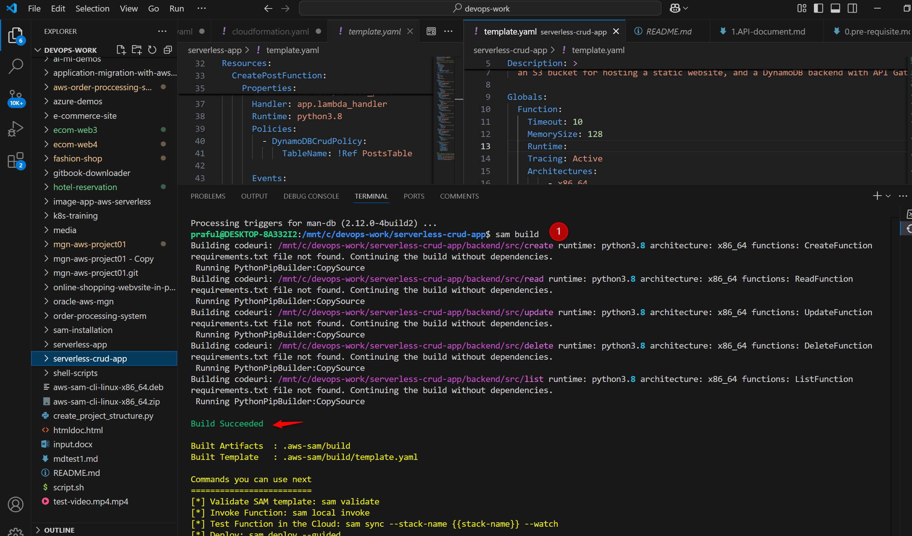
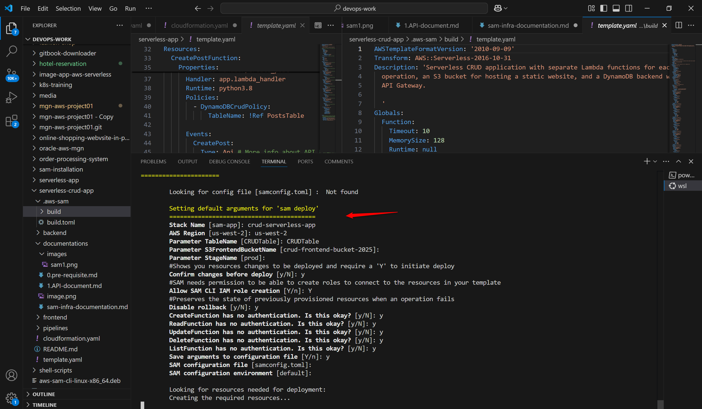
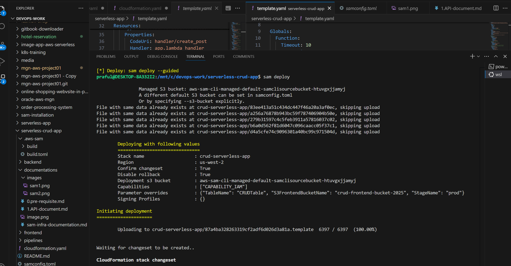
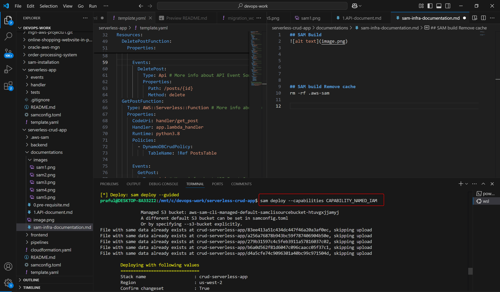
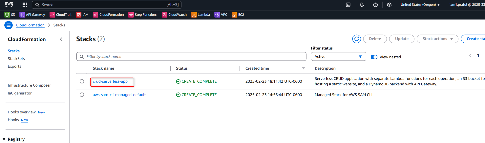

## SAM Build

## SAM deploy

- SAM model deployed successfully with cloudformation template

## SAM build Remove cache
- if there is an issue with the code needs to delete the directory
rm -rf .aws-sam

